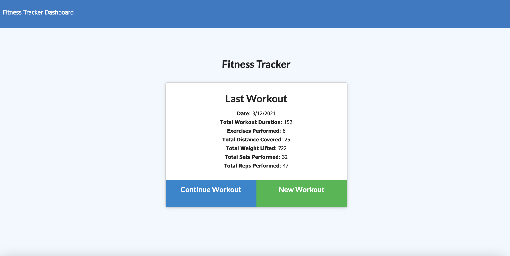
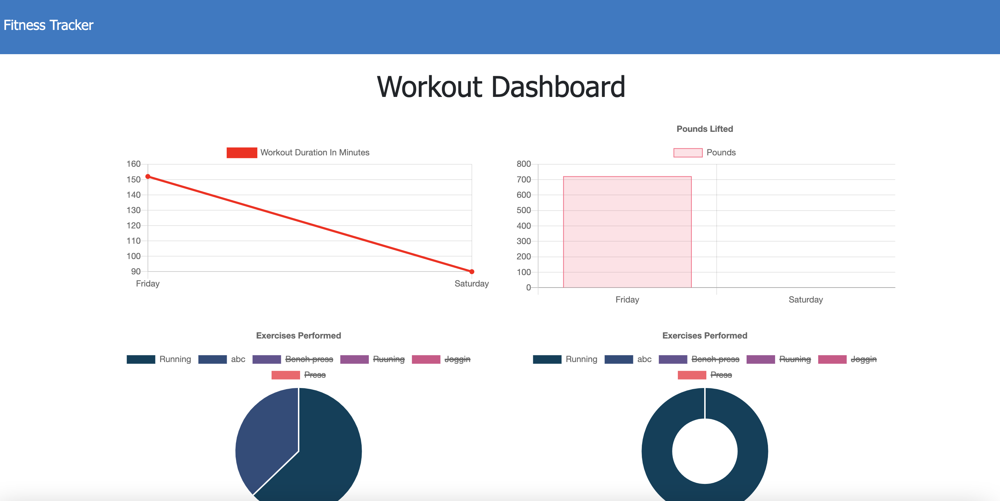
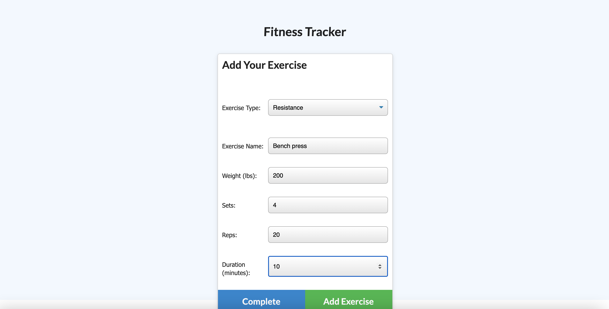

# Workout Tracker

## The purpose:

To create a workout tracker application using Mongo databse with a Mongoose schema and handle routes with Express. This application allows user to view, create and track daily workouts, and log multiple exercises in a workout on a given day. The goal is to make user quickly reach their fitness goals.

## Features:

This application has the following features:

1. Allows users to view, create and track daily workouts
2. Enables users to add exercises to the most recent workout plan
3. Enables users to add new exercises to a new workout plan
4. Displays the combined weight of multiple exercises from the past seven workouts on the stats.html page
5. Displays the total duration of each workout from the past seven workouts on the stats.html page

## Screenshots:

The following pictures show the web application's appearance and functionality:

## Live URL of the deployed application:

[please click here](https://workout-tracker-faisal.herokuapp.com/)
